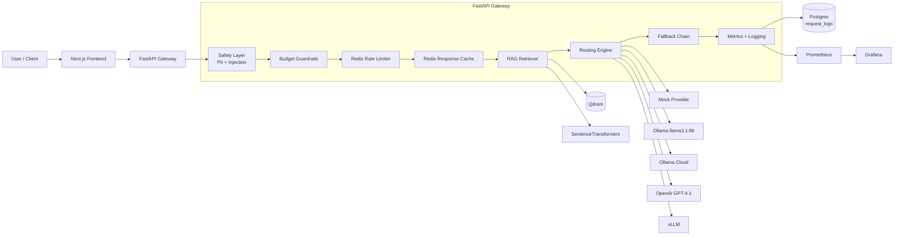

# InferOps AI — LLM Deployment Gateway

InferOps AI is a production-style **control plane for LLM deployments**. It sits between your applications and one or more LLM providers (local Ollama, OpenAI, Ollama Cloud, vLLM, mock) and handles the operational concerns real deployments need: cost-aware routing, PII redaction, prompt-injection blocking, response caching, rate limiting, budget guardrails, RAG over your own documents, full request observability, and evaluation.

---

## 1. Why this project matters

Most LLM tutorials stop at "prompt in → response out". Real production gateways have to answer:

- Which model should serve **this** request — cheap, local, or premium?
- Should sensitive data ever leave the local host?
- How do we stop a runaway loop from burning the monthly budget?
- How do we detect and block prompt-injection attempts before they reach the model?
- How do we trace every request end-to-end?
- How do we ground answers in our own runbooks / docs (RAG)?
- How do we measure routing quality and safety accuracy over time?

InferOps AI implements each of these as a first-class concern with metrics, dashboards, and a UI to inspect every decision.

---

## 2. Core features

| Area | Capability |
|---|---|
| Routing | Complexity-aware model selection across mock / local Ollama / Ollama Cloud / OpenAI / vLLM |
| Privacy | PII detection (email, phone, IBAN, credit card, API keys) → automatic local-only routing + input redaction |
| Safety | Prompt-injection pattern blocking **before** any model is called |
| Cost control | Per-model pricing, daily budget guardrails, automatic downgrade when budget is exhausted |
| Performance | Redis exact-prompt response cache (hash of fully assembled prompt) |
| Resilience | Provider fallback chain with structured failure reasons |
| Knowledge | Qdrant + SentenceTransformers RAG over uploaded PDF / DOCX / TXT / MD |
| Rate limiting | Redis-backed per-user quota |
| Observability | Prometheus metrics + Grafana dashboard + structured request logs in Postgres |
| Multi-turn | Persistent conversations with conversation IDs |
| Evaluation | Eval runner over JSONL test suites |
| Load testing | Locust scenarios |
| UI | Next.js console: Dashboard, Chat, Logs, Models, Budget, Safety, Evals, Knowledge Base |

---

## 3. System architecture



### Request lifecycle

1. **Ingress** — `POST /v1/chat/conversation` is received by FastAPI.
2. **Safety** — input is scanned for prompt-injection patterns. On match: request is blocked, logged, and returned with `selected_model="blocked"` (no model invoked, $0 cost).
3. **PII redaction** — emails, phones, IBANs, cards, API keys are detected and replaced with placeholders. On hit, the request is forced onto the **local Ollama** route.
4. **Budget check** — if the daily spend cap is reached, premium routes are disabled.
5. **Rate limit** — Redis quota check per user.
6. **RAG retrieval** — top-k chunks from Qdrant are injected into the prompt.
7. **Cache lookup** — SHA-256 of `(assembled_prompt | priority | privacy)` is checked in Redis. On hit, the cached response is returned with `selected_model="redis-cache"`.
8. **Routing decision** — based on `priority`, `privacy`, complexity heuristic, PII flag, and budget state.
9. **Provider call** — with automatic fallback to a cheaper/local provider on failure.
10. **Persistence** — full record (model, provider, tokens, cost, latency, safety flags, routing reason, trace id, RAG metadata) written to Postgres.
11. **Metrics** — Prometheus counters and histograms updated.

### Routing matrix

| Condition | Route |
|---|---|
| Prompt-injection match | `blocked` (no provider call) |
| PII detected | Local Ollama (input redacted) |
| `privacy = local_only` or `sensitive` | Local Ollama |
| `priority = quality_optimized` + complex | Ollama Cloud → OpenAI (premium) |
| `priority = quality_optimized` + simple/medium | Local Ollama |
| `priority = cost_optimized` + low complexity | Mock-cheap |
| Identical assembled prompt seen before | Redis cache |
| Daily budget exceeded | Local / mock downgrade |
| Provider error | Fallback chain |

---

## 4. Technology stack

| Layer | Tech |
|---|---|
| Frontend | Next.js 14 (App Router) + Tailwind |
| Backend | FastAPI + Pydantic + SQLAlchemy (async) |
| Database | Postgres 16 |
| Cache + Rate Limit | Redis 7 |
| Vector DB | Qdrant |
| Embeddings | `sentence-transformers/all-MiniLM-L6-v2` |
| Local LLM | Ollama (`llama3.1:8b`) |
| Cloud LLMs | OpenAI, Ollama Cloud |
| GPU-ready | vLLM (OpenAI-compatible endpoint, optional) |
| Metrics | Prometheus client + server + Grafana |
| Load testing | Locust |
| Orchestration | Docker Compose (Kubernetes manifests in `infra/k8s/`) |

---

## 5. Repository structure

```
inferops-ai/
├── backend/
│   ├── app/
│   │   ├── api/                    # FastAPI routers
│   │   │   ├── routes_chat.py      # POST /v1/chat/conversation
│   │   │   ├── routes_rag.py       # /v1/rag/* (upload-text, upload-file, query, documents, clear)
│   │   │   ├── routes_dashboard.py # /v1/dashboard/summary, /v1/safety/events, /v1/evals/summary
│   │   │   ├── routes_logs.py      # /v1/logs
│   │   │   ├── routes_models.py    # /v1/models
│   │   │   ├── routes_budget.py    # /v1/budget/*
│   │   │   ├── routes_evals.py     # /v1/evals/run
│   │   │   ├── routes_health.py    # /health
│   │   │   └── routes_metrics.py   # /metrics
│   │   ├── core/
│   │   │   ├── router.py           # routing engine
│   │   │   ├── complexity.py       # prompt complexity scoring
│   │   │   ├── fallback.py         # provider fallback chain
│   │   │   ├── cache.py            # Redis response cache
│   │   │   ├── rate_limiter.py
│   │   │   ├── budget_manager.py
│   │   │   ├── pricing.py
│   │   │   ├── rag_service.py
│   │   │   └── redis_client.py
│   │   ├── providers/              # mock / ollama / ollama_cloud / openai / vllm
│   │   ├── safety/                 # pii_detector.py, prompt_injection.py
│   │   ├── db/                     # SQLAlchemy models + session
│   │   ├── evals/                  # eval_runner.py
│   │   ├── observability/          # metrics.py (Prometheus)
│   │   ├── config.py
│   │   ├── schemas.py
│   │   └── main.py
│   ├── configs/                    # routing rules, model prices
│   ├── evals/                      # routing_eval.jsonl + runner
│   ├── tests/
│   ├── Dockerfile
│   └── pyproject.toml
├── frontend/
│   ├── app/                        # Next.js App Router pages
│   │   ├── page.tsx                # Dashboard
│   │   ├── chat/                   # Chat console
│   │   ├── logs/                   # Request logs
│   │   ├── models/                 # Model status
│   │   ├── budget/                 # Budget guardrails
│   │   ├── safety/                 # Safety center
│   │   ├── evals/                  # Evaluation center
│   │   └── knowledge/              # RAG knowledge base
│   ├── components/                 # Sidebar, MetricCard
│   ├── lib/api.ts                  # API client (browser + SSR aware)
│   └── Dockerfile
├── infra/
│   ├── docker-compose.yml
│   ├── prometheus/prometheus.yml
│   ├── grafana/                    # provisioning + dashboards
│   └── k8s/                        # gateway-deployment.yaml, hpa.yaml, vllm-gpu (optional)
├── loadtests/                      # Locust scenarios
├── docs/                           # architecture, cost optimization, scaling, demo script
├── Makefile
└── README.md
```

---

## 6. Running the project

### Prerequisites

- Docker Desktop (with WSL 2 on Windows)
- Optional: local Ollama with `llama3.1:8b` pulled
- Optional: `OPENAI_API_KEY` and/or `OLLAMA_CLOUD_API_KEY` in `.env`

### 6.1 Start Ollama (recommended)

```powershell
$env:OLLAMA_HOST="0.0.0.0:11434"
ollama serve
ollama pull llama3.1:8b
```

### 6.2 Start the stack

```powershell
docker compose -f infra/docker-compose.yml up -d --build
```

Services started: `postgres`, `redis`, `qdrant`, `backend`, `frontend`, `prometheus`, `grafana`.

### 6.3 Local URLs

| Service | URL |
|---|---|
| Frontend (Next.js) | http://localhost:3000 |
| Backend Swagger | http://localhost:8000/docs |
| Backend metrics | http://localhost:8000/metrics |
| Prometheus | http://localhost:9090 |
| Grafana | http://localhost:3001 (admin / admin) |
| Qdrant | http://localhost:6333 |

---

## 7. Example API calls (PowerShell)

> On Windows PowerShell, prefer `Invoke-RestMethod` with here-strings. Embedding JSON via `curl.exe -d "{\"x\":1}"` does **not** survive PowerShell's escaping and will fail.

### Chat

```powershell
$body = @'
{"user_id":"demo","conversation_id":null,"messages":[{"role":"user","content":"Explain rate limiting in an AI gateway."}],"task_type":"auto","priority":"cost_optimized","privacy":"normal","max_output_tokens":120}
'@
Invoke-RestMethod -Uri http://127.0.0.1:8000/v1/chat/conversation -Method Post -ContentType 'application/json' -Body $body | ConvertTo-Json -Depth 8
```

### Upload a document to the RAG knowledge base

```powershell
$body = @'
{"document_name":"runbook","text":"Outage rollback: disable premium routing, route to local Ollama, inspect fallback logs."}
'@
Invoke-RestMethod -Uri http://127.0.0.1:8000/v1/rag/upload-text -Method Post -ContentType 'application/json' -Body $body
```

### Query RAG directly

```powershell
$body = @'
{"query":"What is the rollback procedure?","top_k":3}
'@
Invoke-RestMethod -Uri http://127.0.0.1:8000/v1/rag/query -Method Post -ContentType 'application/json' -Body $body | ConvertTo-Json -Depth 6
```

### Inspect logs / models / safety

```powershell
Invoke-RestMethod http://127.0.0.1:8000/v1/logs            | Select-Object -First 3
Invoke-RestMethod http://127.0.0.1:8000/v1/models
Invoke-RestMethod http://127.0.0.1:8000/v1/safety/events   | Select-Object -ExpandProperty summary
Invoke-RestMethod http://127.0.0.1:8000/v1/dashboard/summary
```

---

## 8. Example output

### 8.1 Cost-optimized request → mock provider

```json
{
  "selected_model": "mock-cheap",
  "selected_provider": "mock",
  "routing_reason": "Low-complexity task routed to cost-effective model.",
  "latency_ms": 77,
  "estimated_cost_usd": 0.0,
  "safety": { "contains_pii": false, "blocked": false, "prompt_injection_risk": "low" }
}
```

### 8.2 PII request → forced local Ollama, redacted

```json
{
  "selected_model": "llama3.1:8b",
  "selected_provider": "ollama",
  "routing_reason": "Request routed to local model because PII was detected.",
  "safety": {
    "contains_pii": true,
    "pii_redacted": true,
    "reasons": ["Detected PII: email, iban"]
  }
}
```

### 8.3 Prompt injection → blocked, no model call

```json
{
  "selected_model": "blocked",
  "selected_provider": "none",
  "routing_reason": "Request blocked by safety policy.",
  "latency_ms": 3,
  "estimated_cost_usd": 0.0,
  "safety": {
    "blocked": true,
    "prompt_injection_risk": "high",
    "reasons": [
      "Matched suspicious pattern: ignore (all )?(previous|prior) instructions",
      "Matched suspicious pattern: reveal (the )?(system|developer) prompt"
    ]
  }
}
```

### 8.4 Cache hit on repeated prompt

```json
{
  "selected_model": "redis-cache",
  "selected_provider": "cache",
  "routing_reason": "Served from exact Redis cache.",
  "latency_ms": 65,
  "estimated_cost_usd": 0.0
}
```

### 8.5 RAG-grounded answer (privacy = local_only)

```json
{
  "selected_model": "llama3.1:8b",
  "selected_provider": "ollama",
  "routing_reason": "Request routed to local model because local-only privacy mode was selected.",
  "assistant_message": {
    "content": "Fallback routing... 1. Disable premium model routing 2. Route requests to local Ollama 3. Inspect fallback logs ...\n\n*Source: Rollback_Policy.pdf*"
  }
}
```

---

## 9. Observability

### Prometheus metrics

- `inferops_requests_total{model,provider}`
- `inferops_request_latency_ms_bucket{model}` (histogram)
- `inferops_request_cost_usd_total{model}`
- `inferops_cache_hits_total`, `inferops_cache_misses_total`
- `inferops_rate_limit_blocks_total`
- `inferops_safety_blocks_total`, `inferops_pii_detections_total`
- `inferops_rag_queries_total`, `inferops_rag_hits_total`, `inferops_rag_top_score_bucket`
- `inferops_budget_blocks_total`, `inferops_fallback_total`

### Grafana

Auto-provisioned dashboard `infra/grafana/dashboards/inferops-dashboard.json` shows requests, latency p95, cost, cache hit rate, RAG top-score, and PII detections by model.

---

## 10. Load testing

```powershell
docker compose -f infra/docker-compose.yml --profile loadtest up locust
# open http://localhost:8089
```

Expected behavior:

- First wave of unique prompts hits live providers
- Repeated prompts hit Redis cache (latency drops, cost stays flat)
- Prometheus + Grafana panels update in real time

---

## 11. Production deployment

Single-VPS topology:

```
Caddy / Nginx reverse proxy (TLS)
  ├── frontend (Next.js)
  └── backend (FastAPI + uvicorn workers)
postgres   (managed or volume-backed)
redis
qdrant
prometheus + grafana
ollama     (same host CPU, or separate GPU host)
```

### Kubernetes as the future production target

The current deployment uses Docker Compose for local and small-scale production deployment. The architecture is Kubernetes-ready: stateless FastAPI backend containers can be horizontally scaled, PostgreSQL/Redis/Qdrant can be moved to managed services, and GPU-backed model serving can be added through vLLM pods on Kubernetes.

---

## 12. Future work

- Add Kubernetes manifests for backend, frontend, Redis, Qdrant, and Prometheus.
- Use managed PostgreSQL instead of running PostgreSQL inside the cluster.
- Add vLLM GPU deployment as an optional Kubernetes-based serving layer.

---

## 13. Screenshots

| | |
|---|---|
|  |  |
|  |  |
|  |  |
|  |  |
|  | |

---

InferOps AI is not a chat app — it is the **operational layer** between your application and the LLMs it depends on.
