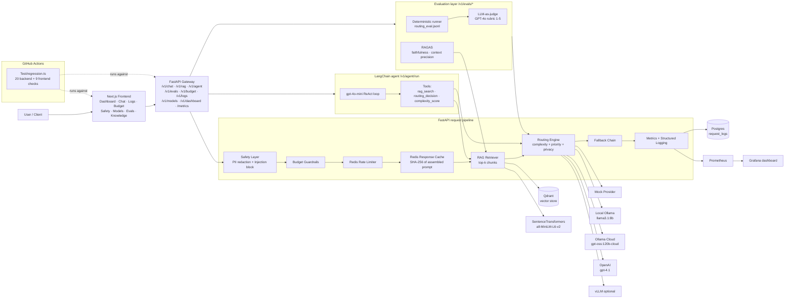
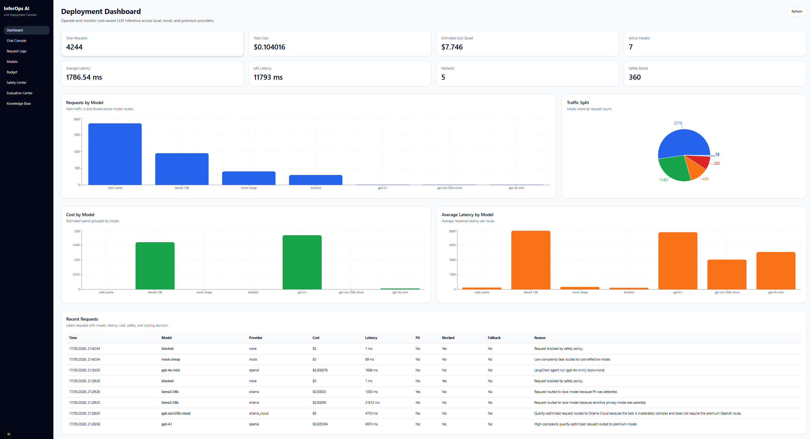
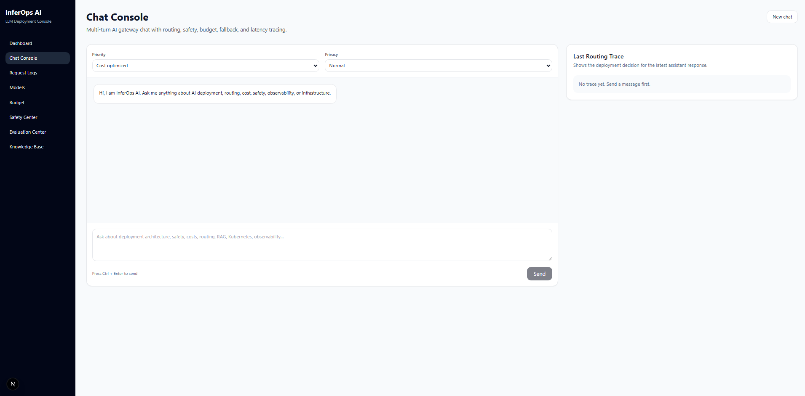
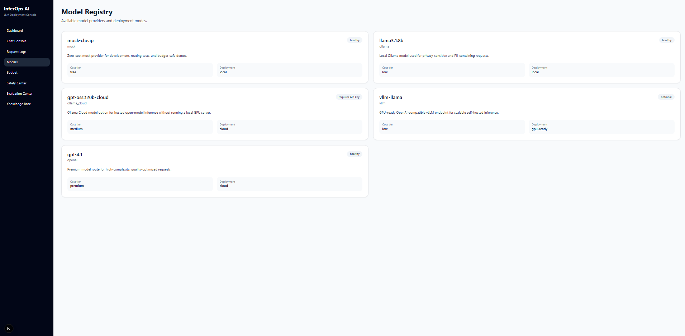
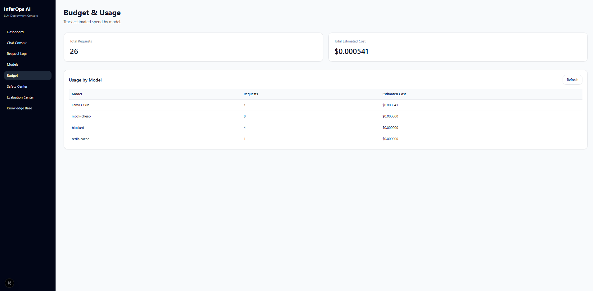
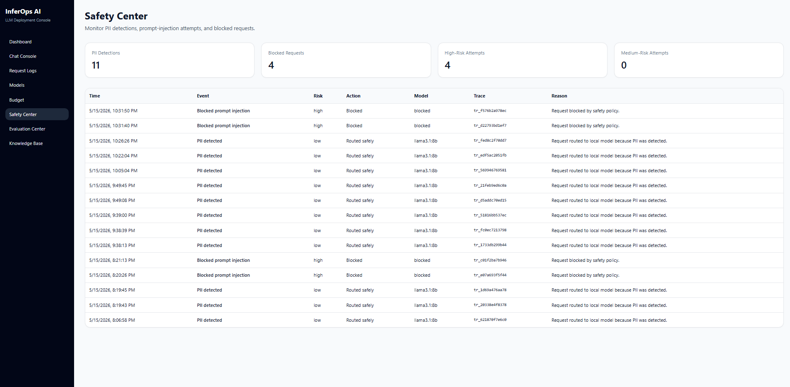
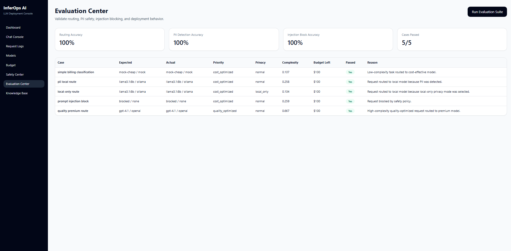
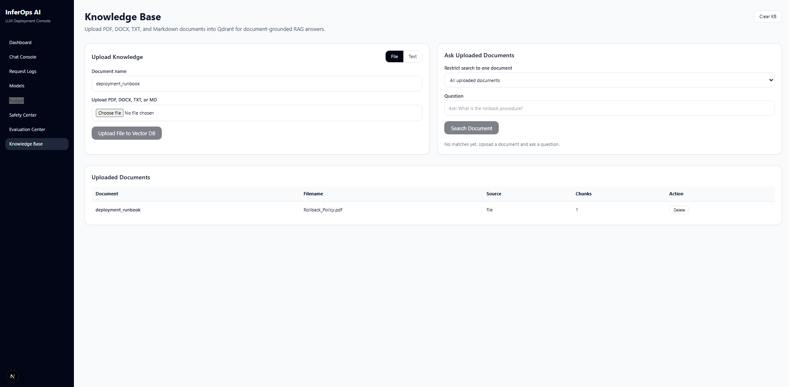
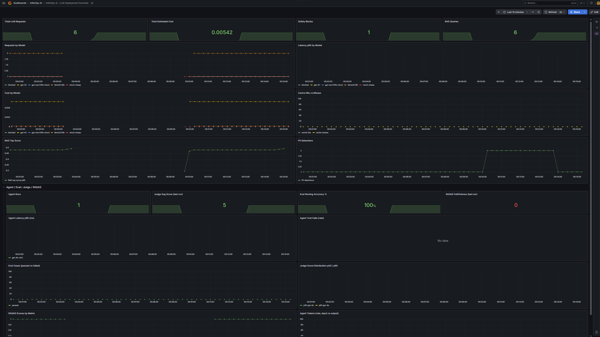
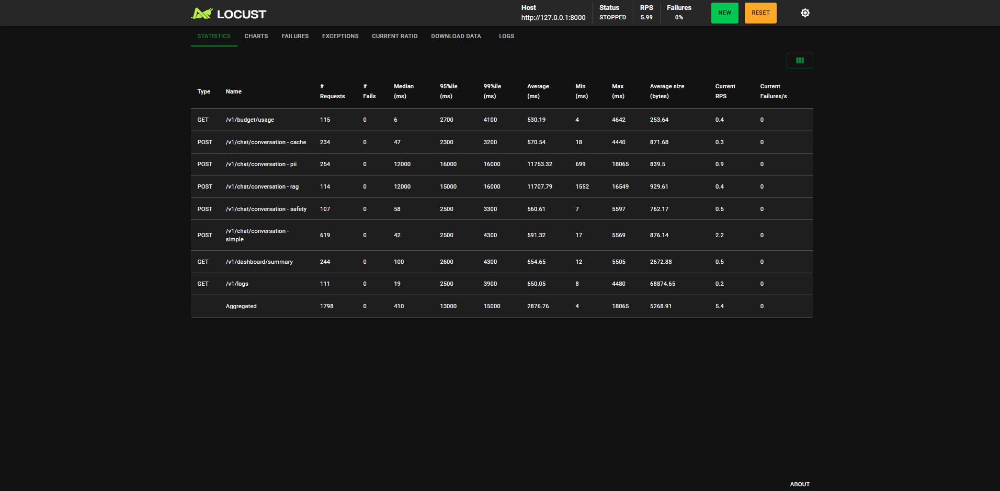

# InferOps AI — LLM Deployment Gateway

InferOps AI is a production-style **control plane for LLM deployments**. It sits between your applications and one or more LLM providers (local Ollama, OpenAI, Ollama Cloud, vLLM, mock) and handles the operational concerns real deployments need: cost-aware routing, PII redaction, prompt-injection blocking, response caching, rate limiting, budget guardrails, RAG over your own documents, full request observability, and evaluation.

Check the Live Demo :[https://d2iduozpu4hqbk.cloudfront.net]

---

## 1. Why this project matters

Most LLM tutorials stop at "prompt in → response out". Real production gateways have to answer:

- Which model should serve **this** request — cheap, local, or premium?
- Should sensitive data ever leave the local host?
- How do we stop a runaway loop from burning the monthly budget?
- How do we detect and block prompt-injection attempts before they reach the model?
- How do we trace every request end-to-end?
- How do we ground answers in our own runbooks / docs (RAG)?
- How do we measure routing quality and safety accuracy over time?

InferOps AI implements each of these as a first-class concern with metrics, dashboards, and a UI to inspect every decision.

---

## 2. Core features

| Area | Capability |
|---|---|
| Routing | Complexity-aware model selection across mock / local Ollama / Ollama Cloud / OpenAI / vLLM |
| Privacy | PII detection (email, phone, IBAN, credit card, API keys) → automatic local-only routing + input redaction |
| Safety | Prompt-injection pattern blocking **before** any model is called (single-pattern match is enough) |
| Cost control | Per-model pricing, daily budget guardrails, automatic downgrade when budget is exhausted |
| Performance | Redis exact-prompt response cache (hash of fully assembled prompt) |
| Resilience | Provider fallback chain with structured failure reasons |
| Knowledge (RAG) | Qdrant + SentenceTransformers RAG over uploaded PDF / DOCX / TXT / MD |
| Rate limiting | Redis-backed per-user quota |
| Observability | Prometheus metrics + Grafana dashboard + structured request logs in Postgres |
| Multi-turn | Persistent conversations with conversation IDs |
| Deterministic evals | JSONL routing eval suite with PII / injection / blocked flags surfaced per case |
| LLM-as-judge | GPT-4o scoring of every routing decision on a 1–5 rubric, with rationales |
| RAGAS metrics | Faithfulness + context precision over the live RAG path |
| Agentic workflow | LangChain tool-calling agent (`rag_search`, `routing_decision`, `complexity_score`) |
| Load testing | Locust scenarios |
| UI | Next.js console: Dashboard, Chat, Logs, Models, Budget, Safety, Evals, Knowledge Base |
| CI regression | 29-check end-to-end suite ([Test/regression.ts](Test/regression.ts)) run on every push via GitHub Actions |
| Code quality | SonarQube scan on every push with a Quality Gate enforcing **coverage > 80%** and **duplicated lines < 3%** ([.github/workflows/sonarqube.yml](.github/workflows/sonarqube.yml)) |

---

## 3. System architecture



### Request lifecycle (`POST /v1/chat/conversation`)

1. **Ingress** — FastAPI accepts the request, assigns a trace id.
2. **Safety — prompt injection** — input is scanned for known injection patterns. A **single** pattern match is enough to block; the request returns immediately with `selected_model="blocked"`, no provider invoked, $0 cost. Source: [backend/app/safety/prompt_injection.py](backend/app/safety/prompt_injection.py).
3. **Safety — PII redaction** — emails, phones, IBANs, credit cards, and API keys are detected. On any hit the input is redacted with placeholders and the request is **forced onto local Ollama** regardless of `priority`. Source: [backend/app/safety/pii_detector.py](backend/app/safety/pii_detector.py).
4. **Budget check** — if the daily spend cap is reached, premium routes (OpenAI, Ollama Cloud) are disabled and the router downgrades to local / mock.
5. **Rate limit** — Redis per-user quota check.
6. **RAG retrieval** — top-k chunks are fetched from Qdrant and injected into the prompt with source citations.
7. **Cache lookup** — SHA-256 of `(assembled_prompt | priority | privacy)` is checked in Redis. On hit the cached response is returned with `selected_model="redis-cache"`, latency typically <100 ms.
8. **Routing decision** — combines `priority`, `privacy`, the complexity score, the PII flag, and the live budget state to pick a provider tier (see matrix below).
9. **Provider call with fallback** — if the chosen provider errors, the fallback chain demotes to a cheaper / local provider and records the failure reason.
10. **Persistence** — the full record (model, provider, tokens in/out, cost, latency, safety flags, routing reason, trace id, RAG metadata) is written to Postgres `request_logs`.
11. **Metrics** — Prometheus counters and histograms are updated.

### Out-of-band workflows

- **Agentic — `POST /v1/agent/run`** — a LangChain ReAct agent (default `gpt-4o-mini`) calls the gateway's own tools (`rag_search`, `routing_decision`, `complexity_score`) and returns an answer plus the full `tools_used` + `steps` trace. Source: [backend/app/agents/rag_agent.py](backend/app/agents/rag_agent.py).
- **Deterministic eval — `POST /v1/evals/run`** — replays the JSONL test suite through the live router and reports `passed_cases / total_cases`, routing accuracy, and per-case safety flags. Source: [backend/app/evals/eval_runner.py](backend/app/evals/eval_runner.py).
- **LLM-as-judge — `POST /v1/evals/judge`** — runs the same suite and asks GPT-4o to score each routing decision on a 1–5 rubric with explicit policy rules (e.g. "PII must never leak to a cloud provider"). Source: [backend/app/evals/judge.py](backend/app/evals/judge.py).
- **RAGAS — `POST /v1/evals/ragas`** — scores the RAG pipeline with `faithfulness` and `context_precision`. If `contexts` is omitted, the live retriever is used so the *production* RAG path is measured. Source: [backend/app/evals/ragas_eval.py](backend/app/evals/ragas_eval.py).
- **Regression CI — every push** — [Test/regression.ts](Test/regression.ts) exercises 20 backend endpoints + 9 frontend pages against a full Docker Compose stack spun up by [.github/workflows/regression.yml](.github/workflows/regression.yml). Exits non-zero on any failure.

### Routing matrix

| Condition | Route |
|---|---|
| Prompt-injection match | `blocked` (no provider call) |
| PII detected | Local Ollama (input redacted) |
| `privacy = local_only` or `sensitive` | Local Ollama |
| `priority = quality_optimized` + complex | Ollama Cloud → OpenAI (premium) |
| `priority = quality_optimized` + simple/medium | Local Ollama |
| `priority = cost_optimized` + low complexity | Mock-cheap |
| Identical assembled prompt seen before | Redis cache |
| Daily budget exceeded | Local / mock downgrade |
| Provider error | Fallback chain |

### Complexity scoring 

The router uses a deliberately simple, transparent heuristic — not an LLM — to
score prompt complexity on a 0.0–1.0 scale. Source: [backend/app/core/complexity.py](backend/app/core/complexity.py).

Algorithm:

1. Start with a baseline of `0.25`.
2. Add a length component: `0.45 × min(len(prompt) / 4000, 1.0)`.
   Longer prompts trend toward higher complexity, capped at 4000 chars.
3. If the prompt contains any **hard keyword** (`reason`, `analyze`, `strategy`,
   `architecture`, `debug`, `legal`, `contract`, `risk`, `multi-step`,
   `evaluate`, `compare`, `derive`) → add `+0.35`.
4. If the prompt contains any **simple keyword** (`classify`, `summarize`,
   `extract`, `rewrite`, `translate`, `short`) → subtract `0.15`.
5. If `task_type` is `classification` or `simple_summary` → subtract `0.20`.
6. If `task_type` is `reasoning`, `analysis`, or `coding` → add `+0.25`.
7. Clamp to `[0.0, 1.0]`.

Pseudocode:

```python
score = 0.25 + 0.45 * min(len(prompt) / 4000, 1.0)
if any(k in prompt.lower() for k in HARD_KEYWORDS):   score += 0.35
if any(k in prompt.lower() for k in SIMPLE_KEYWORDS): score -= 0.15
if task_type in {"classification", "simple_summary"}: score -= 0.20
if task_type in {"reasoning", "analysis", "coding"}:  score += 0.25
return clamp(score, 0.0, 1.0)
```

The score feeds two thresholds defined in [backend/configs/routing_policies.py](backend/configs/routing_policies.py):

- `LOW_COMPLEXITY_THRESHOLD` — below this, cost mode picks the cheapest route.
- `HIGH_COMPLEXITY_THRESHOLD` — at/above this, quality mode picks the premium route.
- Mid-band (`>= 0.55` / `>= 0.70`) routes to Ollama Cloud as the middle tier.

**What this heuristic does well:** it is fast, deterministic, free, and easy
to audit in the request logs (every request stores its `complexity_score`).

**What it does not do:** it does not parse the prompt, it does not understand
semantics, and it can be tricked by length or single keywords. Two prompts
of equal substance can score differently if one happens to contain the word
"analyze". This is acceptable for a routing signal — the worst case is a
prompt being routed one tier too high or too low, not unsafe behavior — and
the LLM-as-judge eval layer (section 12) exists precisely to flag those cases.

---

## 4. Technology stack

| Layer | Tech |
|---|---|
| Frontend | Next.js (App Router) + React + Tailwind |
| Backend | FastAPI + Pydantic + SQLAlchemy (async) |
| Database | Postgres 16 |
| Cache + Rate Limit | Redis 7 |
| Vector DB | Qdrant |
| Embeddings | `sentence-transformers/all-MiniLM-L6-v2` |
| Local LLM | Ollama (`llama3.1:8b`) |
| Cloud LLMs | OpenAI (`gpt-4.1`, `gpt-4o-mini`), Ollama Cloud (`gpt-oss:120b-cloud`) |
| GPU-ready | vLLM (OpenAI-compatible endpoint, optional) |
| Agent framework | LangChain (tool-calling ReAct agent) |
| Eval | Deterministic JSONL runner + LLM-as-judge (GPT-4o) + RAGAS |
| Metrics | Prometheus client + server + Grafana |
| Load testing | Locust |
| Regression | TypeScript end-to-end suite (`tsx`) wired into GitHub Actions |
| Orchestration | Docker Compose (Kubernetes manifests in `infra/k8s/`) |

---

## 5. Repository structure

```
inferops-ai/
├── .github/workflows               # CI pipeline
├── backend/
│   ├── app/
│   │   ├── api/                    # FastAPI routers
│   │   │   ├── routes_chat.py      # POST /v1/chat/conversation
│   │   │   ├── routes_rag.py       # /v1/rag/* (upload-text, upload-file, query, documents, clear)
│   │   │   ├── routes_agent.py     # POST /v1/agent/run (LangChain tool-calling agent)
│   │   │   ├── routes_dashboard.py # /v1/dashboard/summary, /v1/safety/events, /v1/evals/summary
│   │   │   ├── routes_logs.py      # /v1/logs
│   │   │   ├── routes_models.py    # /v1/models
│   │   │   ├── routes_budget.py    # /v1/budget/*
│   │   │   ├── routes_evals.py     # /v1/evals/run, /v1/evals/judge, /v1/evals/ragas
│   │   │   ├── routes_health.py    # /health
│   │   │   └── routes_metrics.py   # /metrics
│   │   ├── core/
│   │   │   ├── router.py           # routing engine
│   │   │   ├── complexity.py       # prompt complexity scoring
│   │   │   ├── fallback.py         # provider fallback chain
│   │   │   ├── cache.py            # Redis response cache
│   │   │   ├── rate_limiter.py
│   │   │   ├── budget_manager.py
│   │   │   ├── pricing.py
│   │   │   ├── rag_service.py
│   │   │   └── redis_client.py
│   │   ├── providers/              # mock / ollama / ollama_cloud / openai / vllm
│   │   ├── safety/                 # pii_detector.py, prompt_injection.py
│   │   ├── agents/                 # rag_agent.py (LangChain ReAct agent + tools)
│   │   ├── db/                     # SQLAlchemy models + session
│   │   ├── evals/                  # eval_runner.py, judge.py, ragas_eval.py
│   │   ├── observability/          # metrics.py (Prometheus)
│   │   ├── config.py
│   │   ├── schemas.py
│   │   └── main.py
│   ├── configs/                    # routing rules, model prices
│   ├── evals/                      # routing_eval.jsonl + runner
│   ├── tests/
│   ├── Dockerfile
│   └── pyproject.toml
├── frontend/
│   ├── app/                        # Next.js App Router pages
│   │   ├── page.tsx                # Dashboard
│   │   ├── chat/                   # Chat console
│   │   ├── logs/                   # Request logs
│   │   ├── models/                 # Model status
│   │   ├── budget/                 # Budget guardrails
│   │   ├── safety/                 # Safety center
│   │   ├── evals/                  # Evaluation center
│   │   └── knowledge/              # RAG knowledge base
│   ├── components/                 # Sidebar, MetricCard
│   ├── lib/api.ts                  # API client (browser + SSR aware)
│   └── Dockerfile
├── infra/
│   ├── docker-compose.yml
│   ├── prometheus/prometheus.yml
│   ├── grafana/                    # provisioning + dashboards
│   └── k8s/                        # gateway-deployment.yaml, hpa.yaml, vllm-gpu (optional)
├── loadtests/                      # Locust scenarios
├── docs/                           # architecture, cost optimization, scaling, demo script
├── Test/                           # Full-stack regression suite (regression.ts)
├── Makefile
└── README.md
```

---

## 6. Running the project

### Prerequisites

- Docker Desktop (with WSL 2 on Windows)
- Optional: local Ollama with `llama3.1:8b` pulled
- Optional: `OPENAI_API_KEY` and/or `OLLAMA_CLOUD_API_KEY` in `.env`

### 6.1 Start Ollama (recommended)

```powershell
$env:OLLAMA_HOST="0.0.0.0:11434"
ollama serve
ollama pull llama3.1:8b
```

### 6.2 Start the stack

```powershell
docker compose -f infra/docker-compose.yml up -d --build
```

Services started: `postgres`, `redis`, `qdrant`, `backend`, `frontend`, `prometheus`, `grafana`.

### 6.3 Local URLs

| Service | URL |
|---|---|
| Frontend (Next.js) | http://localhost:3000 |
| Backend Swagger | http://localhost:8000/docs |
| Backend metrics | http://localhost:8000/metrics |
| Prometheus | http://localhost:9090 |
| Grafana | http://localhost:3001 (admin / admin) |
| Qdrant | http://localhost:6333 |

### 6.4 Running the new features locally

These features need a paid OpenAI key (and, for the medium-complexity
quality route, an Ollama Cloud key) in `.env` at the repo root. They are
deliberately **skipped in CI** to keep every push free — run them locally.

| Feature | How to trigger |
|---|---|
| OpenAI premium route | `POST /v1/chat` with `priority="quality_optimized"` and a long, hard-keyword prompt (≥0.65 complexity) — routed to `gpt-4.1` |
| Ollama Cloud route | `POST /v1/chat` with `priority="quality_optimized"` and a medium-complexity prompt (0.55–0.65) — routed to `gpt-oss:120b-cloud` |
| LangChain agent | `POST /v1/agent/run` `{"question": "..."}` — returns `answer`, `tools_used`, `steps` |
| Deterministic eval | `POST /v1/evals/run {}` — replays JSONL suite, returns `passed_cases/total_cases` |
| LLM-as-judge | `POST /v1/evals/judge {}` — GPT-4o scores each routing decision, returns `average_judge_score` |
| RAGAS metrics | `POST /v1/evals/ragas` with optional `samples` — returns `faithfulness` + `context_precision` |
| Full regression (29/29) | `npx -y tsx Test/regression.ts` from repo root |
| Frontend Evaluation Center | Open http://localhost:3000/evals — runs the three eval endpoints via buttons |
| Frontend Knowledge Base | Open http://localhost:3000/knowledge — upload PDF/DOCX/TXT/MD, then query |

Watch the routing decisions land in:

- **Dashboard** — http://localhost:3000 — total requests, cost, cache hit rate
- **Logs** — http://localhost:3000/logs — per-request model / cost / safety flags / RAG metadata
- **Safety** — http://localhost:3000/safety — PII detections and injection blocks
- **Grafana** — http://localhost:3001 — latency p95, cost, RAG top-score histograms

---

## 7. Example API calls (PowerShell)

> On Windows PowerShell, prefer `Invoke-RestMethod` with here-strings. Embedding JSON via `curl.exe -d "{\"x\":1}"` does **not** survive PowerShell's escaping and will fail.

### Chat

```powershell
$body = @'
{"user_id":"demo","conversation_id":null,"messages":[{"role":"user","content":"Explain rate limiting in an AI gateway."}],"task_type":"auto","priority":"cost_optimized","privacy":"normal","max_output_tokens":120}
'@
Invoke-RestMethod -Uri http://127.0.0.1:8000/v1/chat/conversation -Method Post -ContentType 'application/json' -Body $body | ConvertTo-Json -Depth 8
```

### Upload a document to the RAG knowledge base

```powershell
$body = @'
{"document_name":"runbook","text":"Outage rollback: disable premium routing, route to local Ollama, inspect fallback logs."}
'@
Invoke-RestMethod -Uri http://127.0.0.1:8000/v1/rag/upload-text -Method Post -ContentType 'application/json' -Body $body
```

### Query RAG directly

```powershell
$body = @'
{"query":"What is the rollback procedure?","top_k":3}
'@
Invoke-RestMethod -Uri http://127.0.0.1:8000/v1/rag/query -Method Post -ContentType 'application/json' -Body $body | ConvertTo-Json -Depth 6
```

### Inspect logs / models / safety

```powershell
Invoke-RestMethod http://127.0.0.1:8000/v1/logs            | Select-Object -First 3
Invoke-RestMethod http://127.0.0.1:8000/v1/models
Invoke-RestMethod http://127.0.0.1:8000/v1/safety/events   | Select-Object -ExpandProperty summary
Invoke-RestMethod http://127.0.0.1:8000/v1/dashboard/summary
```

---

## 8. Example output

### 8.1 Cost-optimized request → mock provider

```json
{
  "selected_model": "mock-cheap",
  "selected_provider": "mock",
  "routing_reason": "Low-complexity task routed to cost-effective model.",
  "latency_ms": 77,
  "estimated_cost_usd": 0.0,
  "safety": { "contains_pii": false, "blocked": false, "prompt_injection_risk": "low" }
}
```

### 8.2 PII request → forced local Ollama, redacted

```json
{
  "selected_model": "llama3.1:8b",
  "selected_provider": "ollama",
  "routing_reason": "Request routed to local model because PII was detected.",
  "safety": {
    "contains_pii": true,
    "pii_redacted": true,
    "reasons": ["Detected PII: email, iban"]
  }
}
```

### 8.3 Prompt injection → blocked, no model call

```json
{
  "selected_model": "blocked",
  "selected_provider": "none",
  "routing_reason": "Request blocked by safety policy.",
  "latency_ms": 3,
  "estimated_cost_usd": 0.0,
  "safety": {
    "blocked": true,
    "prompt_injection_risk": "high",
    "reasons": [
      "Matched suspicious pattern: ignore (all )?(previous|prior) instructions",
      "Matched suspicious pattern: reveal (the )?(system|developer) prompt"
    ]
  }
}
```

### 8.4 Cache hit on repeated prompt

```json
{
  "selected_model": "redis-cache",
  "selected_provider": "cache",
  "routing_reason": "Served from exact Redis cache.",
  "latency_ms": 65,
  "estimated_cost_usd": 0.0
}
```

### 8.5 RAG-grounded answer (privacy = local_only)

```json
{
  "selected_model": "llama3.1:8b",
  "selected_provider": "ollama",
  "routing_reason": "Request routed to local model because local-only privacy mode was selected.",
  "assistant_message": {
    "content": "Fallback routing... 1. Disable premium model routing 2. Route requests to local Ollama 3. Inspect fallback logs ...\n\n*Source: Rollback_Policy.pdf*"
  }
}
```

---

## 9. Observability

### Prometheus metrics

Core request pipeline:

- `inferops_requests_total{model,provider,status}`
- `inferops_request_latency_ms_bucket{model,provider}` (histogram)
- `inferops_request_cost_usd_total{model,provider}`
- `inferops_cache_hits_total`, `inferops_cache_misses_total`
- `inferops_rate_limit_blocks_total`
- `inferops_safety_blocks_total`, `inferops_pii_detections_total`
- `inferops_rag_queries_total{used}`, `inferops_rag_retrieved_chunks_bucket`, `inferops_rag_top_score_bucket`
- `inferops_budget_remaining_usd{user_id}`, `inferops_fallback_total{from_provider,to_provider}`

Advanced features (agent, deterministic eval, LLM judge, RAGAS):

- `inferops_agent_runs_total{model,status}` — counter, agent runs
- `inferops_agent_latency_ms_bucket{model}` — histogram, agent end-to-end latency
- `inferops_agent_tool_calls_total{tool}` — counter, per-tool invocations (`rag_search`, `routing_decision`, `complexity_score`)
- `inferops_agent_tokens_total{kind}` — counter, `input` vs `output` tokens
- `inferops_eval_runs_total` — counter, deterministic eval suite runs
- `inferops_eval_cases_total{result}` — counter, `passed` vs `failed`
- `inferops_eval_routing_accuracy` — gauge, last routing accuracy (%)
- `inferops_judge_runs_total{judge_model,status}` — counter, LLM-as-judge runs
- `inferops_judge_score_bucket{judge_model}` — histogram, per-case judge score (1–5)
- `inferops_judge_avg_score{judge_model}` — gauge, last run average
- `inferops_ragas_runs_total{status}` — counter, RAGAS runs
- `inferops_ragas_score{metric}` — gauge, last run aggregate (`faithfulness`, `context_precision`)

### Grafana

Auto-provisioned dashboard `infra/grafana/dashboards/inferops-dashboard.json` shows:

- **Request pipeline row**: total requests, total cost, safety blocks, RAG queries, requests/latency p95/cost by model, cache hit rate, RAG top-score, PII detections.
- **Agent / Eval / Judge / RAGAS row**: agent run count, judge avg score (colored 0–5), eval routing accuracy %, RAGAS faithfulness, agent latency p95, agent tool-call rate by tool, eval passed/failed timeline, judge score p50/p95 distribution, RAGAS scores by metric, agent token rate (input vs output).

---

## 10. Load testing

```powershell
docker compose -f infra/docker-compose.yml --profile loadtest up locust
# open http://localhost:8089
```

Expected behavior:

- First wave of unique prompts hits live providers
- Repeated prompts hit Redis cache (latency drops, cost stays flat)
- Prometheus + Grafana panels update in real time

---

## 11. Production deployment

The Production deployment details are mentioned in the production branch [https://github.com/sandipanseal/InferOps-AI/tree/aws-deploy]

---

## 12. Agentic workflow & advanced evaluation

This section covers the three capabilities that sit *on top* of the gateway:
a tool-using agent, an LLM-as-judge routing reviewer, and RAGAS metrics.

All three are optional and require `OPENAI_API_KEY` (and the langchain / ragas
deps in [backend/pyproject.toml](backend/pyproject.toml)) because they all
depend on a function-calling LLM as the reasoning / judging engine.

### 12.1 LangChain agentic workflow

Source: [backend/app/agents/rag_agent.py](backend/app/agents/rag_agent.py),
endpoint in [backend/app/api/routes_agent.py](backend/app/api/routes_agent.py).

A LangChain tool-calling agent (ReAct-style, default `gpt-4o-mini`) is exposed
that can call three InferOps tools and reason over their results:

| Tool | What it does |
|---|---|
| `rag_search(query, top_k)` | Retrieves top-k chunks from Qdrant via the same path the chat route uses |
| `routing_decision(prompt, priority)` | Asks the live router which model would serve a prompt, including the complexity score and reason |
| `complexity_score(prompt)` | Returns the raw 0..1 complexity score |

The agent decides which tools to call, in what order, and synthesizes a final
answer with citations to the documents it pulled from `rag_search`.

```powershell
$body = @'
{"question":"Given our runbook, what is the rollback procedure for a premium-routing outage, and which model would handle a follow-up debug request?"}
'@
Invoke-RestMethod -Uri http://127.0.0.1:8000/v1/agent/run -Method Post -ContentType 'application/json' -Body $body | ConvertTo-Json -Depth 8
```

The response contains the final `answer`, the list of `tools_used`, and the
full `steps` (tool call + observation) so the trace is auditable.

### 12.2 LLM-as-judge routing eval (GPT-4)

Source: [backend/app/evals/judge.py](backend/app/evals/judge.py).

The deterministic eval suite in [backend/app/evals/eval_runner.py](backend/app/evals/eval_runner.py)
only checks exact `expected_model == actual_model`. That misses "right answer
for the wrong reason" cases.

`/v1/evals/judge` runs the same suite, then asks **GPT-4** (configurable, e.g.
`gpt-4o`) to score every routing decision on a 1–5 rubric:

```
5 - optimal routing decision, well-justified
4 - reasonable decision, minor concerns
3 - acceptable, but a better route exists
2 - clearly suboptimal
1 - wrong route (e.g. PII leaked to a cloud provider)
```

The judge receives the input, priority, privacy, selected model/provider,
complexity score, and routing reason — and returns strict JSON `{score, rationale}`.

```powershell
$body = '{"judge_model":"gpt-4o"}'
Invoke-RestMethod -Uri http://127.0.0.1:8000/v1/evals/judge -Method Post -ContentType 'application/json' -Body $body | ConvertTo-Json -Depth 6
```

Returns `average_judge_score`, `routing_accuracy`, and per-case rationales.

### 12.3 RAGAS metrics (faithfulness, context precision)

Source: [backend/app/evals/ragas_eval.py](backend/app/evals/ragas_eval.py).

`/v1/evals/ragas` evaluates RAG pipeline quality with the official `ragas`
package:

| Metric | Meaning |
|---|---|
| `faithfulness` | Fraction of claims in the answer supported by retrieved context. 1.0 = perfectly grounded, 0.0 = hallucinated. |
| `context_precision` | Average precision of retrieved chunks ranked against the ground-truth answer. |

Both metrics use an LLM judge internally (RAGAS default = OpenAI).

Provide samples directly, or omit `contexts` and the endpoint will fetch them
via the live InferOps RAG retriever — which means you are evaluating the
*production* retrieval path, not a mock.

```powershell
$body = @'
{
  "samples": [
    {
      "question": "What is the rollback procedure?",
      "answer": "Disable premium routing, route to local Ollama, inspect fallback logs.",
      "ground_truth": "Disable premium model routing, route requests to local Ollama, inspect fallback logs."
    }
  ],
  "top_k": 4
}
'@
Invoke-RestMethod -Uri http://127.0.0.1:8000/v1/evals/ragas -Method Post -ContentType 'application/json' -Body $body | ConvertTo-Json -Depth 6
```

The response contains aggregate `scores` (mean per metric) and `samples`
(per-row scores) so regressions can be tracked per question over time.

---

## 13. Future work

- Add Kubernetes manifests for backend, frontend, Redis, Qdrant, and Prometheus.
- Use managed PostgreSQL instead of running PostgreSQL inside the cluster.
- Add vLLM GPU deployment as an optional Kubernetes-based serving layer.

---

## 14. CI/CD

The project includes a GitHub Actions pipeline that validates backend imports, frontend production builds, Docker image builds, and production Compose configuration before deployment. A separate **SonarQube** workflow runs static analysis and enforces a code-quality gate on every push.

### 14.1 Full-stack regression test

Source: [Test/regression.ts](Test/regression.ts).

A single TypeScript script exercises the **entire** running stack end-to-end —
20 backend checks (health, models, dashboard, budget, logs, 6 chat routing
scenarios, RAG upload/query, evals, LLM judge, RAGAS, agent, Prometheus) plus
9 frontend checks (every page returns HTTP 200 with the expected H2, and the
sidebar exposes all 7 navigation links). It uses Node 18+ global `fetch`, so
no dependencies need to be installed beyond `tsx`.

Run **locally** against a running stack (executes all 29 checks, including the
paid OpenAI / Ollama Cloud / GPT-4o-judge / RAGAS / agent calls):

```powershell
docker compose -f infra/docker-compose.yml up -d --build
npx -y tsx Test/regression.ts
```

Environment overrides:

| Var | Default | Purpose |
|---|---|---|
| `BACKEND_URL` | `http://127.0.0.1:8000` | Backend base URL |
| `FRONTEND_URL` | `http://localhost:3000` | Frontend base URL |
| `SKIP_LOCAL_OLLAMA` | `0` | Set to `1` to skip the two checks that require a local Ollama daemon (used in CI) |
| `SKIP_CLOUD` | `0` | Set to `1` to skip every check that consumes a paid cloud API key — OpenAI `gpt-4.1`, Ollama Cloud, GPT-4o judge, RAGAS, LangChain agent (used in CI) |

Skipped tests still **PASS** with a `skipped (...)` message so the suite
totals stay at 29/29 in CI. Locally, leave both flags unset to exercise
everything. The process exits non-zero on any real failure.

### 14.2 Regression on every push (GitHub Actions)

Workflow: [.github/workflows/regression.yml](.github/workflows/regression.yml).

On every push and pull request to any branch the workflow:

1. Writes a CI `.env` with empty `OPENAI_API_KEY` and `OLLAMA_CLOUD_API_KEY`
   (CI does not have, and does not need, real keys).
2. Builds and starts the full Docker Compose stack.
3. Waits up to 2 minutes for `/health` and the frontend root.
4. Runs `npx -y tsx Test/regression.ts` with `SKIP_LOCAL_OLLAMA=1` **and**
   `SKIP_CLOUD=1`, so every push is free.
5. On failure, dumps the last 300 lines of every container's logs.
6. Always tears the stack down (`docker compose down -v`).

**Cost-by-design:** the CI run never calls OpenAI or Ollama Cloud, never
invokes the GPT-4o LLM judge, never runs RAGAS, and never spins up the
LangChain agent. Those paths are exercised by running the script locally —
where a developer's existing keys already cover the spend. No GitHub
repository secrets are required for the workflow to pass.

### 14.3 SonarQube code-quality gate on every push

Workflow: [.github/workflows/sonarqube.yml](.github/workflows/sonarqube.yml).
Scanner config: [sonar-project.properties](sonar-project.properties).

On every push and pull request to any branch the workflow:

1. Checks out the repo with full git history (`fetch-depth: 0`) so Sonar can
   compute accurate blame and “New Code” metrics.
2. Sets up Python 3.11, installs the backend with `pytest` + `pytest-cov`,
   and runs the backend test suite producing `backend/coverage.xml` and a
   JUnit `pytest-report.xml`.
3. Sets up Node 20 and installs frontend dependencies (frontend coverage
   hook is wired but commented out until a Jest/Vitest suite is added —
   TS/JS files are still scanned for bugs, smells, and duplication).
4. Runs `SonarSource/sonarqube-scan-action@v4` to upload sources + coverage
   to the SonarQube server.
5. Runs `SonarSource/sonarqube-quality-gate-action@v1`, which polls the
   Quality Gate result and **fails the build red** when the gate is not
   met.

#### Quality Gate thresholds (enforced server-side in SonarQube)

| Metric | Operator | Value |
|---|---|---|
| Coverage | is less than | **80.0%** |
| Duplicated Lines (%) | is greater than | **3.0%** |
| Reliability Rating *(optional)* | is worse than | A |
| Security Rating *(optional)* | is worse than | A |


---

## 15. Screenshots

| | |
|---|---|
|  |  |
|  |  |
|  |  |
|  |  |
|  |  |

---

InferOps AI is not a chat app — it is the **operational layer** between your application and the LLMs it depends on.
